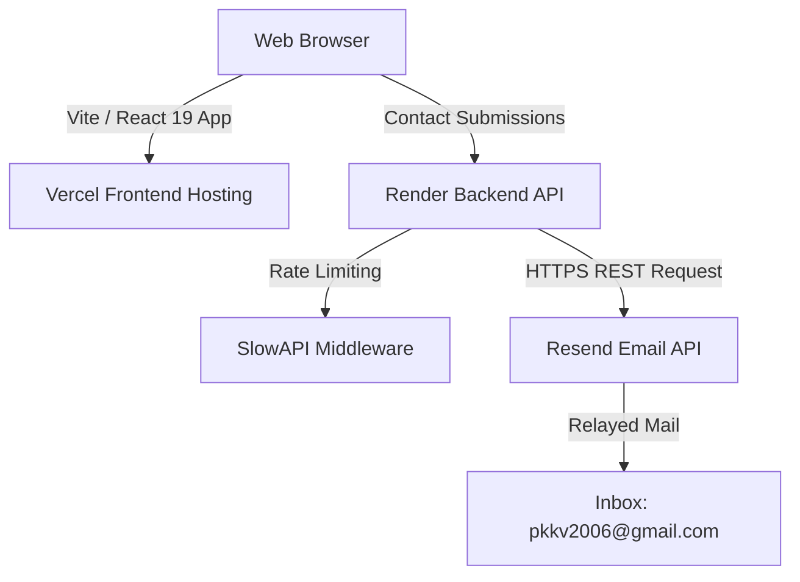

<div align="center">

<br/>

# ✦ PRASHANT KUMAR

### Personal Portfolio — `prashantkumar.site`

<br/>

[](https://prashantkumar.site)&nbsp;&nbsp;[](https://prashantkumar.site)&nbsp;&nbsp;[](LICENSE)

<br/>

> An ultra-premium, high-performance personal portfolio built for modern web standards.  
> Fluid animations · Modular grid structures · Live competitive programming stats · Robust backend contact system.

<br/>

</div>

---

## Table of Contents

- [Design Philosophy](#-design-philosophy)
- [Architecture](#-architecture)
- [Tech Stack](#️-tech-stack)
- [Getting Started](#-getting-started)
  - [Prerequisites](#prerequisites)
  - [Frontend Setup](#frontend-setup)
  - [Backend Setup](#backend-setup)
- [Production Deployment](#-production-deployment)
- [License](#-license)

---

## 🎨 Design Philosophy

Every visual decision in this portfolio is intentional:

| Element | Choice | Rationale |
|---|---|---|
| **Display Font** | Bebas Neue (`line-height: 0.95`) | High-end editorial feel with tight vertical leading |
| **Background** | Deep charcoal `#0f0f14` | Creates visual depth without pure black harshness |
| **Body Text** | Off-white `#f0ede8` | Warm contrast against dark backgrounds |
| **Accents** | `#ff6b35` (orange) · `#3b82f6` (blue) | High-contrast vibrant pops for CTAs and highlights |
| **Motion** | Physics-based spring animations via Framer Motion | Fluid, natural-feeling micro-interactions on every card |

---

## 🏗 Architecture



The frontend is a statically deployed React app on Vercel. Contact form submissions are routed to a FastAPI backend on Render, which applies rate-limiting before forwarding emails via Resend — sidestepping common ISP/hosting SMTP port restrictions entirely.

---

## 🛠️ Tech Stack

### Frontend &nbsp;`/frontend`

| Layer | Technology |
|---|---|
| Core | React 19, TypeScript, Vite |
| Styling | Tailwind CSS with custom typography classes |
| Animation | Framer Motion, Lucide Icons |
| Hosting | Vercel (custom domain) |

### Backend &nbsp;`/backend`

| Layer | Technology |
|---|---|
| Core | FastAPI, Uvicorn (ASGI) |
| Rate Limiting | SlowAPI (IP-based, spam prevention) |
| Mail Routing | HTTPX → Resend API |
| Hosting | Render (Free Tier web service) |

---

## 🚀 Getting Started

### Prerequisites

Make sure the following are installed before continuing:

- [Node.js](https://nodejs.org/) `v18+`
- [Python](https://www.python.org/) `v3.11+`

---

### Frontend Setup

```bash
# 1. Navigate to the frontend directory
cd frontend

# 2. Install dependencies
npm install

# 3. Start the development server
npm run dev
```

Your app will be live at **`http://localhost:5173`**.

---

### Backend Setup

**1. Navigate to the backend directory**
```bash
cd backend
```

**2. Create and activate a virtual environment**
```bash
# macOS / Linux
python3 -m venv venv && source venv/bin/activate

# Windows (PowerShell / CMD)
python -m venv venv && .\venv\Scripts\activate
```

**3. Install Python dependencies**
```bash
pip install -r requirements.txt
```

**4. Configure environment variables**

Create a `.env` file inside the `/backend` folder:

```env
# Generate a free key at https://resend.com
RESEND_API_KEY=re_YOUR_SECRET_KEY

# Recipient for contact form submissions
TO_EMAIL=pkkv2006@gmail.com
```

> [!IMPORTANT]
> Replace `re_YOUR_SECRET_KEY` with your actual Resend API key before testing contact form submissions locally.

**5. Start the API server**
```bash
uvicorn main:app --reload
```

Your backend API will be live at **`http://127.0.0.1:8000`**.

---

## 🌐 Production Deployment

### Frontend — Vercel

Set the Vercel project root to `/frontend` with the following configuration:

| Setting | Value |
|---|---|
| Build Command | `npm run build` |
| Output Directory | `dist` |

### Backend — Render

Deployed automatically via Git integration using `backend/render.yaml`. The following environment variables must be set in the **Render Dashboard**:

- `RESEND_API_KEY`
- `TO_EMAIL`

### DNS Configuration — GoDaddy → Vercel

The custom domain **`prashantkumar.site`** is routed via GoDaddy DNS:

| Type | Name | Value | TTL |
|---|---|---|---|
| `A` | `@` | `76.76.21.21` | 600s |
| `CNAME` | `www` | `cname.vercel-dns.com` | 600s |

---

## 📄 License

Licensed under the **MIT License** — feel free to fork, modify, and build your own portfolio from this template.

---

<div align="center">

Made with ☕ by **Prashant Kumar** · [prashantkumar.site](https://prashantkumar.site)

</div>
